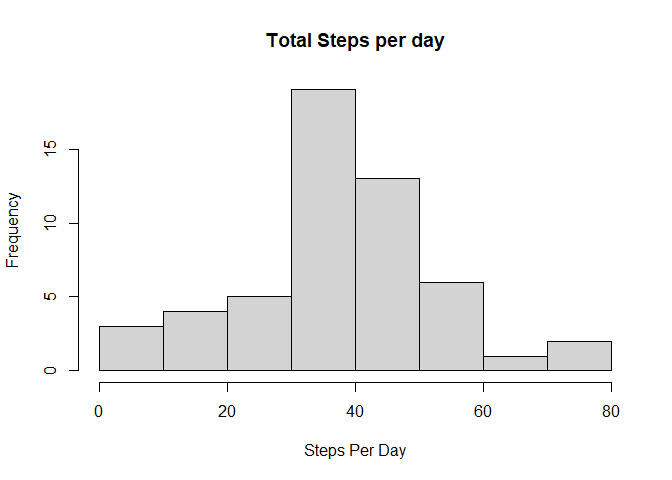
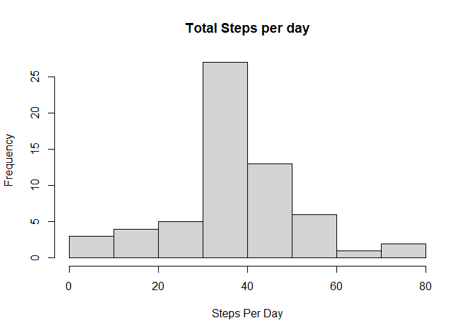
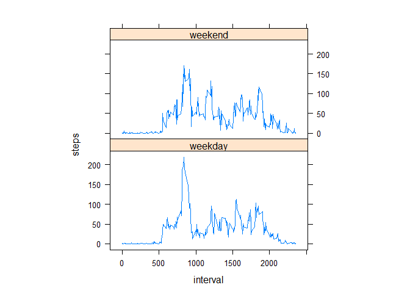

## Loading and preprocessing the data
The first step before starting the data analysis process is importing alll required libraries. The code is as below.


```r
  library(dplyr)
```

```
## 
## Attaching package: 'dplyr'
```

```
## The following objects are masked from 'package:stats':
## 
##     filter, lag
```

```
## The following objects are masked from 'package:base':
## 
##     intersect, setdiff, setequal, union
```

```r
  library(lattice)
```

The GitHub repository contains the dataset for the assignment in "activity.zip" file. So We do not have to download the data separately. The first thing we do is  unzip the csv file and load the data. The code for this is as below.


```r
  unzip("activity.zip")
  activity <- read.csv("activity.csv")
  head(activity)
```

```
##   steps       date interval
## 1    NA 2012-10-01        0
## 2    NA 2012-10-01        5
## 3    NA 2012-10-01       10
## 4    NA 2012-10-01       15
## 5    NA 2012-10-01       20
## 6    NA 2012-10-01       25
```

We see that the date column is in character format. It is better to convert it to date format using the following code.


```r
  activity$date <- as.POSIXct(activity$date)
```


## What is mean total number of steps taken per day?
To compute the number of steps taken per day, we first remove the data rows where steps are missing. Then we group by date and calculate the mean. The code to accomplish this is as below.


```r
  stepsPerDay <-  activity[!is.na(activity$steps),1:2] %>% 
                        group_by(date) %>%
                              summarise_all(mean)
```

A histogram of steps taken each day is made and mean and median daily steps are calculated to understand the daily activity pattern.


```r
  hist(stepsPerDay$steps,xlab = "Steps Per Day", main = "Total Steps per day")
```

<!-- -->

```r
  dmean <- mean(stepsPerDay$steps)
  dmedian <- median(stepsPerDay$steps)
```

The mean and median of total number of steps taken per day are 37.3825996 and 37.3784722 respectively. 
## What is the average daily activity pattern?
 
To understand the average daily activity pattern, we will compute the average activity in all the available 5-minute intervals and plot it as a line graph. Additionally, we identify which interval contains the maximum number of steps on average. The code to accomplish this is given below.


```r
  avg5MActivity <- aggregate(steps~interval, data = activity, FUN = mean, na.rm = TRUE)
  topavginterval <- avg5MActivity$interval[which.max(avg5MActivity$steps)]
  plot(steps~interval,data = avg5MActivity,type = "l")
```

<!-- -->

The 5-minute interval that contains the maximum average number of steps is 835 
## Imputing missing values
We see that there are a lot of missing data. To calculate the number of missing values in the dataset the following code is used.


```r
  sum(is.na(activity$steps))
```

```
## [1] 2304
```
That is a lot of missing data. Let us fill the missing values with the mean of the respective interval.


```r
  imputedactivity <- activity  
    count = 0  # Count the number of data filled in
    for (i in 1:nrow(imputedactivity)) {
      if (is.na(imputedactivity[i, ]$steps)) {
         imputedactivity[i, ]$steps <- avg5MActivity[avg5MActivity$interval == imputedactivity[i, ]$interval, ]$steps
        count = count + 1
      }
    }
```

Now if we plot a histogram showing the number of daily steps with the imputed dataset, we observe the following.


```r
  imputedstepsPerDay <-  imputedactivity[,1:2] %>% 
                              group_by(date) %>%
                                  summarise_all(mean)
  hist(imputedstepsPerDay$steps,xlab = "Steps Per Day", main = "Total Steps per day")
```

<!-- -->
The new mean and median computation is done as follows.


```r
  imputedmean <- mean(imputedstepsPerDay$steps)
  imputedmedian <- median(imputedstepsPerDay$steps)
```

The new mean and median are 37.3825996 and 37.3825996 respectively. We see that the mean didnot change and median came closer to the mean because we used the avg interval values to impute missing data.

## Are there differences in activity patterns between weekdays and weekends?

To analyse the differnece in activity patterns between weekdays and weekends, we will first have to use the wday parameter from the POSIXlt format to create an identifier for weekday and weekend. This is accomplished as follows 

```r
  imputedactivity$day=ifelse(as.POSIXlt(as.Date(imputedactivity$date))$wday%%6==0, "weekend","weekday")

  imputedactivity$day=factor(imputedactivity$day,levels=c("weekday","weekend"))
```

Post this, we need to calculate means for each 5-minute interval for these 2 classifications using the code as mentioned below.


```r
  imputedStepsInterval <- aggregate(steps ~ interval + day, imputedactivity, mean)
  xyplot(steps ~ interval | factor(day), data = imputedStepsInterval, aspect = 1/2, type = "l")
```

<!-- -->


